# SDN-ML-Blockchain System Diagrams Index

---

## 1. System Overview Architecture

**Mô tả**: Kiến trúc tổng thể hệ thống bao gồm Application Layer, Control Plane, Data Plane, và Blockchain Layer.

**File**: [`diagrams/01_system_overview.mmd`](diagrams/01_system_overview.mmd)

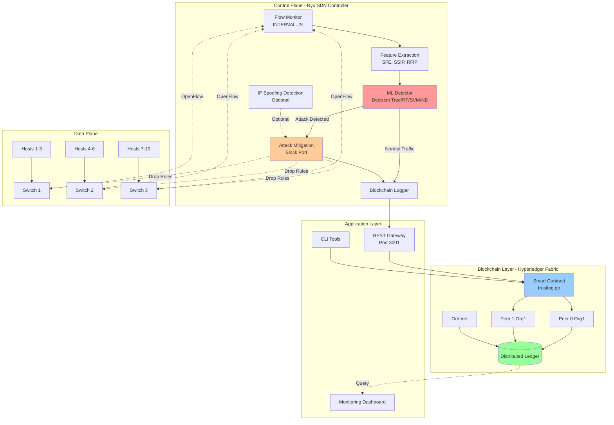

---

## 2. Attack Detection Flow

**Mô tả**: Luồng phát hiện và xử lý tấn công DDoS từ khi phát hiện đến khi ghi log vào Blockchain.

**File**: [`diagrams/02_attack_detection_flow.mmd`](diagrams/02_attack_detection_flow.mmd)

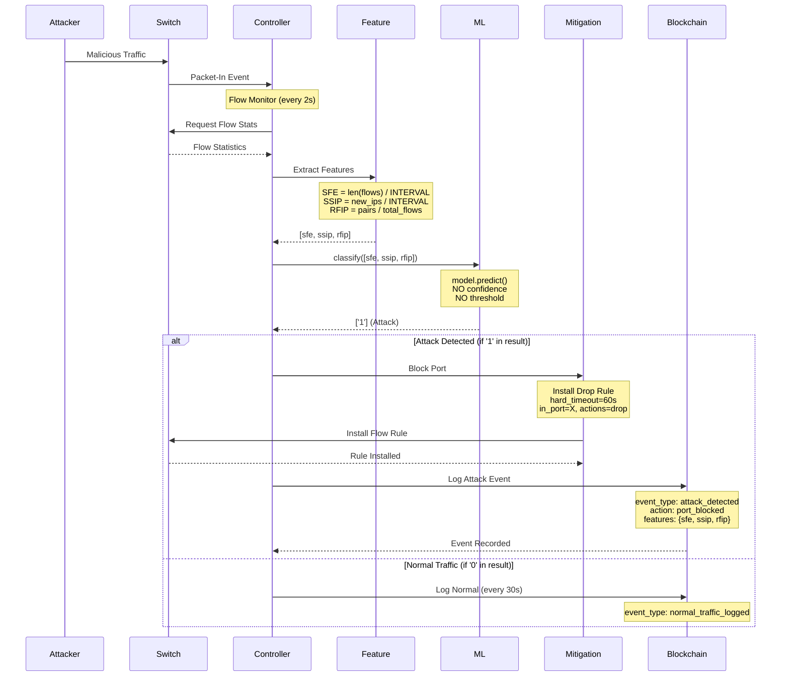

---

## 3. ML Detection Pipeline

**Mô tả**: Pipeline chi tiết của quá trình phát hiện tấn công bằng Machine Learning.

**File**: [`diagrams/03_ml_detection_pipeline.mmd`](diagrams/03_ml_detection_pipeline.mmd)

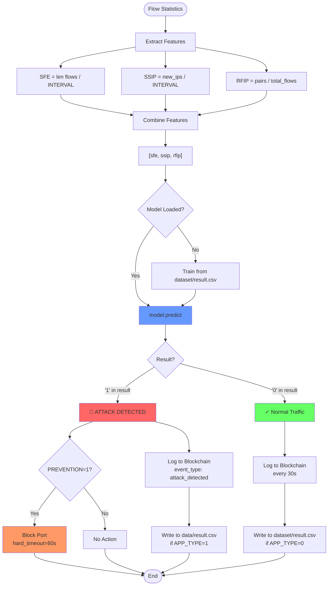

---

## 4. Blockchain Layer Architecture

**Mô tả**: Kiến trúc chi tiết của lớp Blockchain sử dụng Hyperledger Fabric.

**File**: [`diagrams/04_blockchain_layer.mmd`](diagrams/04_blockchain_layer.mmd)

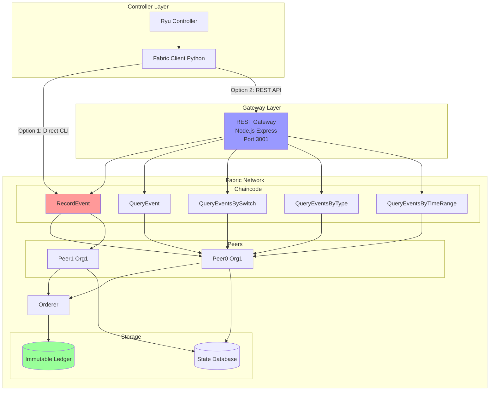

---

## 5. SecurityEvent Data Structure

**Mô tả**: Cấu trúc dữ liệu SecurityEvent được lưu trữ trong Blockchain.

**File**: [`diagrams/05_data_structure.mmd`](diagrams/05_data_structure.mmd)

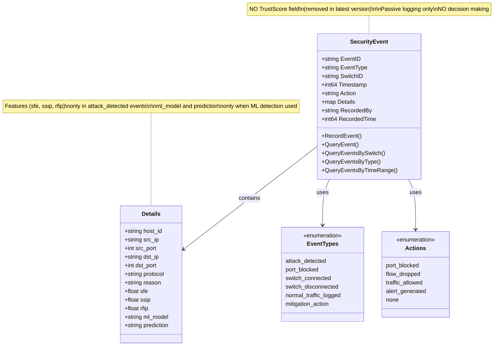

---

## 6. Data Collection and Training Workflow

**Mô tả**: Quy trình thu thập dữ liệu và huấn luyện ML model.

**File**: [`diagrams/06_data_collection_training.mmd`](diagrams/06_data_collection_training.mmd)

```mermaid
flowchart LR
    subgraph "Collection Mode APP_TYPE=0"
        START1[Start System<br/>APP_TYPE=0<br/>TEST_TYPE=0/1]
        RUN1[Run Topology<br/>normal/attack]
        COLLECT1[Controller Collects<br/>Features + Label]
        WRITE1[Write to<br/>dataset/result.csv]
    end
    
    subgraph "Training Phase"
        TRAIN[Train ML Models<br/>python3 ml_detector.py]
        LOAD[Load dataset/result.csv]
        SPLIT[NO train/test split<br/>Use all data]
        FIT[model.fit X, y]
        SAVE[Save model.pkl<br/>decision_tree.pkl<br/>random_forest.pkl<br/>svm.pkl<br/>naive_bayes.pkl]
    end
    
    subgraph "Detection Mode APP_TYPE=1"
        START2[Start System<br/>APP_TYPE=1<br/>PREVENTION=1]
        RUN2[Run Topology<br/>attack traffic]
        DETECT[ML Detects<br/>model.predict]
        BLOCK[Block if '1' in result]
        WRITE2[Write to<br/>data/result.csv]
    end
    
    START1 --> RUN1
    RUN1 --> COLLECT1
    COLLECT1 --> WRITE1
    
    WRITE1 -.Manual.-> TRAIN
    TRAIN --> LOAD
    LOAD --> SPLIT
    SPLIT --> FIT
    FIT --> SAVE
    
    SAVE -.Model Ready.-> START2
    START2 --> RUN2
    RUN2 --> DETECT
    DETECT --> BLOCK
    BLOCK --> WRITE2
    
    style WRITE1 fill:#99ccff
    style SAVE fill:#ff9999
    style BLOCK fill:#ffcc99
```

---

## 7. Production Deployment Architecture

**Mô tả**: Kiến trúc triển khai hệ thống trong môi trường Production.

**File**: [`diagrams/07_production_deployment.mmd`](diagrams/07_production_deployment.mmd)

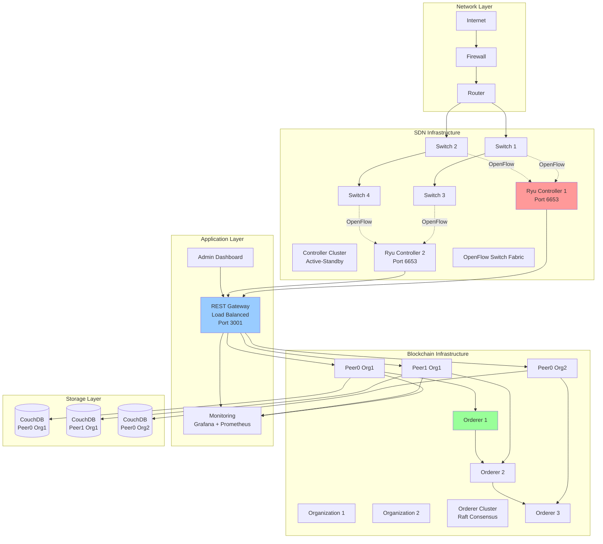

---

## 8. IP Spoofing Detection vs ML Detection

**Mô tả**: So sánh và phân biệt giữa cơ chế phát hiện IP Spoofing và ML Detection.

**File**: [`diagrams/08_ip_spoofing_vs_ml.mmd`](diagrams/08_ip_spoofing_vs_ml.mmd)

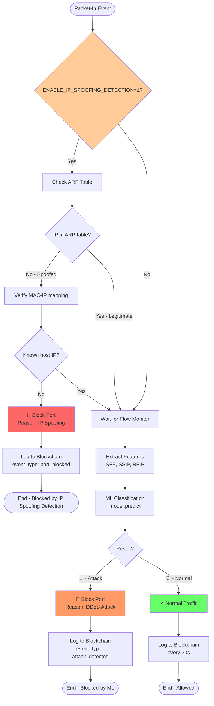

---

## 9. Component Interaction Diagram

**Mô tả**: Sơ đồ tương tác chi tiết giữa tất cả các thành phần trong hệ thống.

**File**: [`diagrams/09_component_interaction.mmd`](diagrams/09_component_interaction.mmd)

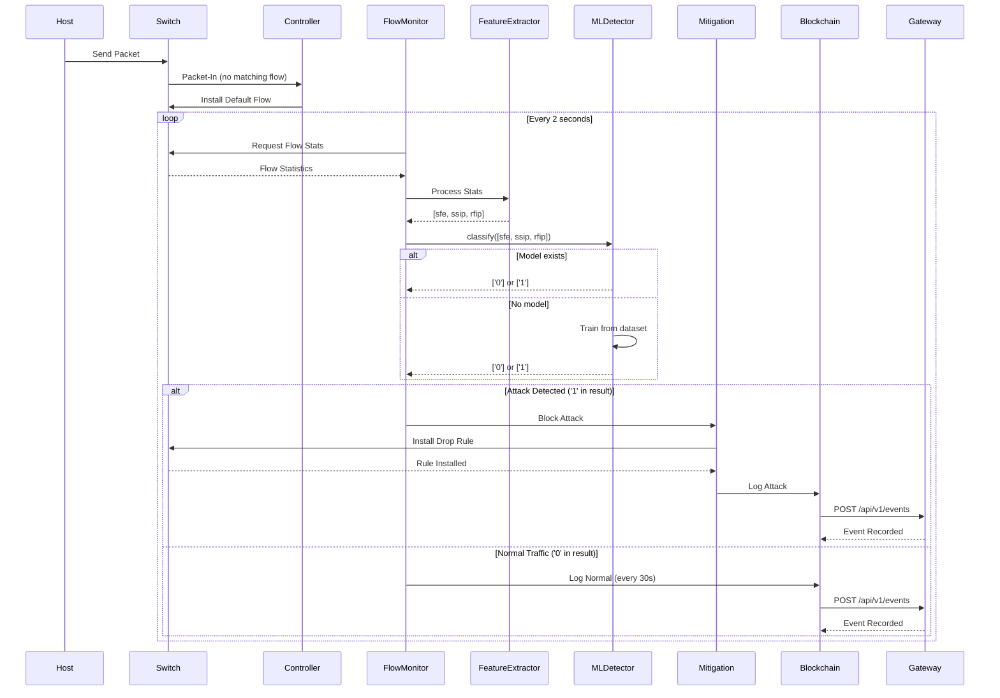

---

## 10. Feature Extraction Process

**Mô tả**: Quy trình chi tiết trích xuất các đặc trưng SFE, SSIP, RFIP.

**File**: [`diagrams/10_feature_extraction.mmd`](diagrams/10_feature_extraction.mmd)

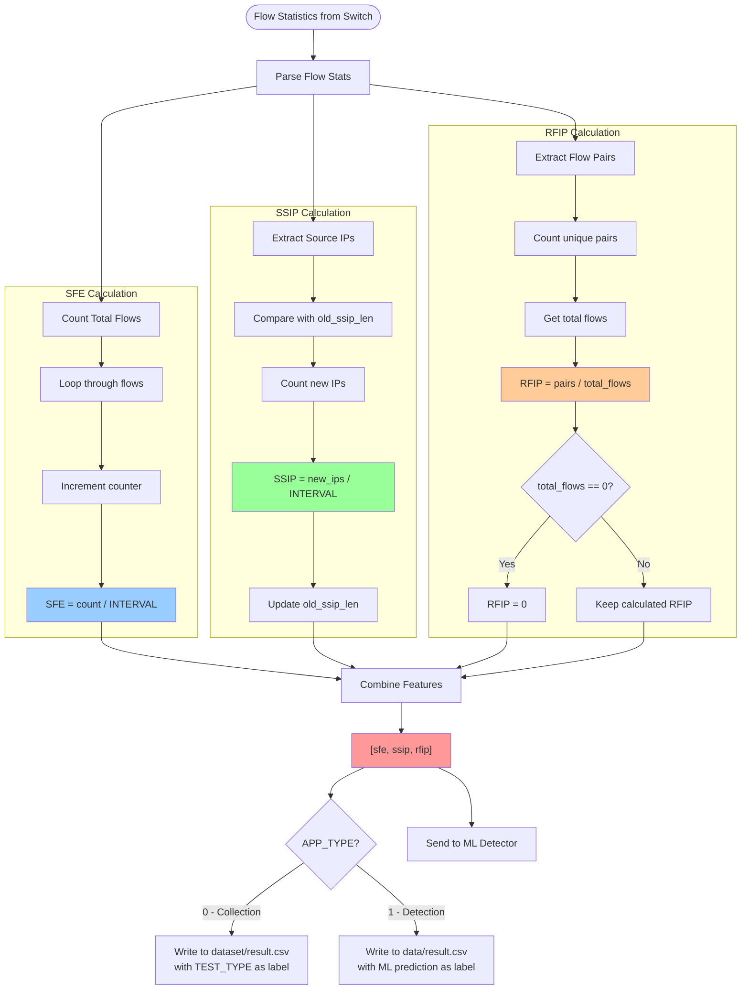

---

## 11. System Operation Modes

**Mô tả**: State machine mô tả các chế độ hoạt động của hệ thống.

**File**: [`diagrams/11_system_modes.mmd`](diagrams/11_system_modes.mmd)

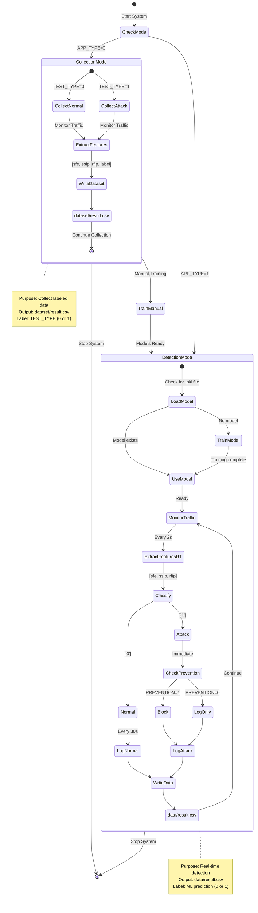

---

## 12. ML Model Comparison

**Mô tả**: So sánh các thuật toán Machine Learning được sử dụng trong hệ thống.

**File**: [`diagrams/12_ml_model_comparison.mmd`](diagrams/12_ml_model_comparison.mmd)

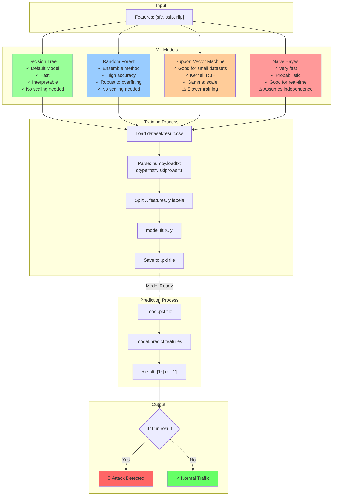

---

